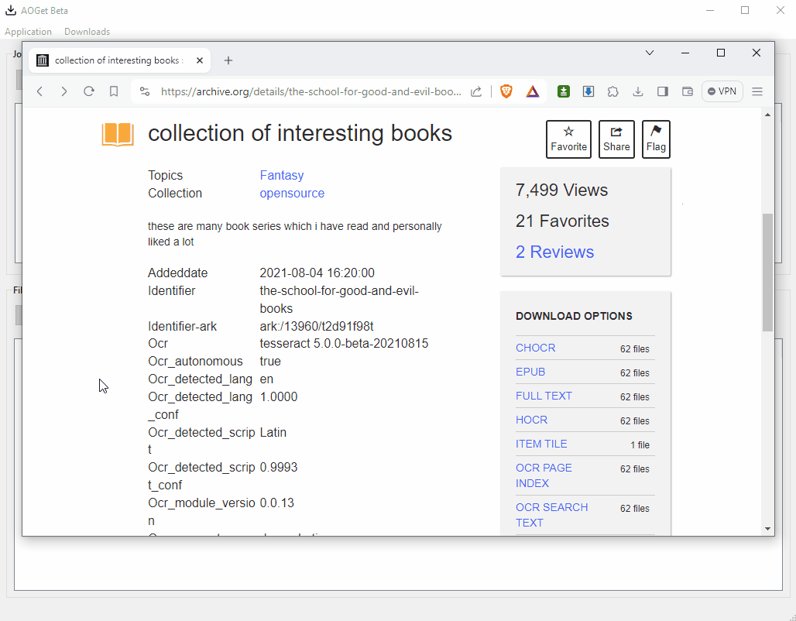

# Get
Download the installer from the [Releases page](https://github.com/endre-git/aoget/releases). The latest version is **0.9.0**. Happy downloading!

# What's this?
AOGet is a download manager for easy fileset downloads from archive.org, or any other website that provides directory listing - a collection of downloadable URLs on a single page.

## Single GIF manual

## Limitations, known issues
* The app is in beta. Expect issues.
* It was written in Python and can be a little slow with large filesets.
* It does not support parallel download threads for a single file, but can download many files in parallel.
* No auto-retry as of the first beta release.
* You can set global bandwidth limits, but not on a per-file basis.
* The app does not explore directories recursively, it's limited to the flat set of files on a page.
* There is no support for page logins, CAPTCHAs or any other non-trivial downloads.
* As of 0.9.0 the rate display will be unreliable with very slow servers (<4KB/s) or many threads + bandwidth limit.
* The target filenames are not temporaray as is the good practice with download managers (.filepart etc.)

## What's next?
I plan to do updates if the app sees some actual use.
* [v0.9.1 Milestone](https://github.com/endre-git/aoget/milestone/10) is mostly a technical increment to enable faster development.
* [v1.0 Milestone](https://github.com/endre-git/aoget/milestone/6) would be about actual enhancements.
* [Later](https://github.com/endre-git/aoget/milestone/9) are nice-to-haves.

# Contribute
## Give feedback
Please use the [Discussions](https://github.com/endre-git/aoget/discussions/) tab.

## Report bugs
When the app crashes, it'll prompt you to open a new issue. If you have a GitHub account, or willing to create one, please report issues. If you want to go the extra mile, you can check in the [existing set of issues](https://github.com/endre-git/aoget/issues/) whether your case was reported already.

## Develop
You can actively develop AOGet. Take a look at the [issues](https://github.com/endre-git/aoget/issues/), fix one, raise a PR and bug me to get it reviewed and merged.

### Principles
* OOP Python & clean code please, with type hinting and documenting all visible APIs
* Adhere to Flake8 and Black formatter as per .vscode settings found in the codebase
* Test coverage / vulnerability metrics should not worsen

### Setting up VSCode (optional)
This is more notes for me, but you might find it useful if you want to setup your dev env for contribution.
* Download VSCode
* Install your favourite virtual env manager (I personally use Anaconda)
* Add the following extensions to VSCode
  * Python extension for Visual Studio Code
  * Black Formatter (find the one with the most downloads)
  * Flake8 - this adds linting support
  * Python Test Explorer for Visual Studio Code
* Create your virtual environment (my example: conda create --name aoget-venv python)
* Activate your virtual environment in VSCode (Ctrl-P then Select Python Interpreter)
* Checkout git from VSCode or from the command line and use Open Folder from VSCode (trust the authors :))
* Run a sanity-check pytest from a terminal
